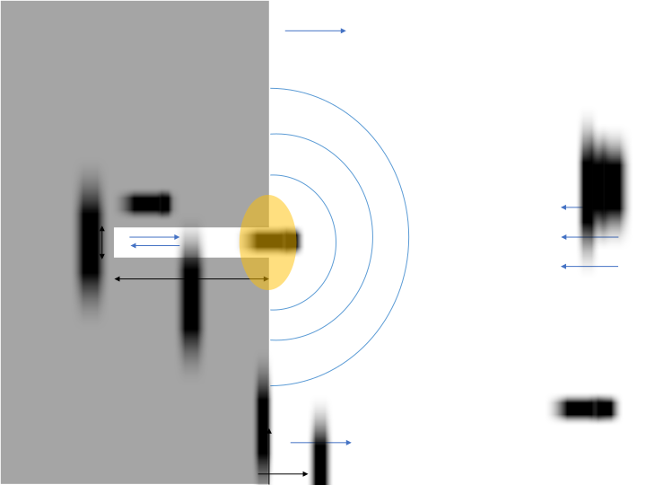

+++
title = "2次元開口端補正の導出"
date = 2021-01-06
[extra]
toc = true
[taxonomies]
tags = ["physics", "acoustics", ]
+++

長さ $L$ の気柱の一方の端点が開いているとき, その中の音波に関する共鳴条件は
$$k_n = \frac{ 2 n - 1 }{ 2 } \frac{  \pi }{ L + l_\mathrm{E} } , \ \ n = 1, 2, 3, \cdots$$
により与えられ, 気柱の長さ $L$ にある補正量 $l_\mathrm{E}$ を加えた長さの気柱として振る舞っているように見える.
補正量 $l_\mathrm{E}$ を [__開口端補正__](https://ja.wikipedia.org/wiki/開口端補正) (end correction) と呼び, 気柱の半径 $a$ の 0.6-0.8 倍程度の値である.
フランジなし円柱に関する開口端補正の解析的な表式は [Levine & Schwinger (1948)](https://doi.org/10.1103%2FPhysRev.73.383) 
によって得られているものの, その導出は極めて煩雑な計算を伴う.
しかし2次元フランジありの開口端補正に関しては比較的容易にそれを導くことができる.
そこで本記事では柴田正和『漸近級数と特異摂動法』に従って開口端補正の表式を導出する.

# セットアップ

<figure>
    
</figure>

図のような幅 $2 a$, 長さ $L$ の通路状の領域について考える. 
時間依存性について Fourier 変換することにより, 速度ポテンシャル $\varphi$ は2次元 Helmholtz 方程式
$$( \nabla^2 + k^2 ) \varphi = 0$$
を満足する. これを遠方 $x \to \infty$ から平面波 $e^{- i k x}$ が入射しているという境界条件のもとで解き,
この通路に生じる定在波を求めることが目標である.
以下では通路内 (領域 I), 開口端付近 (領域 II), 外部 (領域 III) を別個に取り扱う.

# 各領域の解

## 領域 I

領域 I の解としては, 通路に沿った平面波のみに興味がある. その一般解は 1 次元波動方程式から
$$\varphi = A e^{i k x} + C e^{- i k x}$$
であるが, $x = L$ において流体速度の壁面の法線成分がゼロ $\partial_x \varphi = 0$ という境界条件を課すことにより
$$\varphi = \frac{ B }{ 2 } ( e^{i k (x + L)} + e^{- i k (x + L)} ) = B \cos k ( x + L ) \tag{1}$$
となる. 

## 領域 II

領域 II は開口端付近の距離 $\sim a$ の領域であるが, いま音波の波長が通路の半径より十分に小さいという条件のもとでは, 
この領域の流れは非圧縮性とみなすことができ, 従ってその解を等角写像の方法によって求めることができる.
物理的な空間を $z = x + i y$ により複素平面上の領域とみなすとき, Schwarz-Christoffel 変換
$$z = \frac{ 2 a }{ \pi } \left[ - i \sqrt{ w^2 - 1 } + \ln \frac{ w }{ \sqrt{ w^2 - 1 } + i } \right]$$
によりこの領域は上半平面 $H^+$ へと写像される. そこで $H^+$ 上の関数
$$\Phi ( w ) = D \ln w + F \tag{2}$$
を複素速度ポテンシャルとみなすとき, 後で見るように正しく求める流れを与える.

## 領域 III

領域 III の解は入射波 $e^{- i k x}$ と壁面によるその反射波 $e^{i k x}$, そして開口端からの放射の和である.
このうち開口端からの放射については, 極座標 $( r, \theta )$ を用いるとき明らかに極角 $\theta$ に依存せず,
従って2次元 Helmholtz 方程式の極座標系での表式
$$\partial_r^2 \varphi + \frac{ 1 }{ r } \partial_r \varphi + k^2 \varphi = 0$$
からその解は Bessel 関数である. これが遠方で外向き波であるためには, その解として Hankel 関数 $H_0^{(1)}$ を選べばよい.
従って領域 III の解は $T$ を係数として
$$\varphi = 2 \cos k x + T H_0^{(1)} ( k r ) \tag{3}$$
により与えられる. 

# 漸近接続

領域 I, II, III はそれぞれオーバーラップ領域を持つため, そこでこれらの解が滑らかに接続される必要がある.

## 領域 I-II

まず領域 I と領域 II の解を接続する. 領域 I の解 (1) は $x \to - 0$ の極限で
$$\varphi \sim B \cos k L - B k x \sin k L$$
という漸近形を持ち, $x$ の一次関数となる. 一方領域 II の解 (2) は, まず $w \to 0$ の極限で Schwarz-Christoffel 変換は
$$w \sim \exp \left( \frac{ \pi }{ 2 a } z - \ln \frac{ e }{ 2 i } \right)$$
となるため, 速度ポテンシャル $\varphi = \mathrm{Re} \, \Phi$ の漸近形は
$$\varphi \sim D \frac{ \pi }{ 2 a } x - D \ln \frac{ e }{ 2 } + F$$
となり, やはり $x$ の一次関数である. 従って定数項および $x$ の係数が一致するという条件
$$B \cos k L = - D \ln \frac{ e }{ 2 } + F \tag{4a}$$
$$B k \sin k L = - D \frac{ \pi }{ 2 a } \tag{4b}$$
が満足されれば, これらの解は滑らかに接続される.

## 領域 II-III

領域 III の解は開口端付近で漸近形
$$\varphi \sim 2 + T \left( 1 + \frac{ 2 i }{ \pi } \ln \frac{ \gamma k r }{ 2 } \right)$$
を持つ ($\gamma$ は Euler の定数). 一方, 領域 II の解は, $w \to \infty$ での Schwarz-Christoffel 変換の漸近形
$$w \sim \frac{ i \pi }{ 2 a } z$$
から
$$\varphi \sim D \ln \frac{ \pi r }{ 2 a } + F$$
となる. 従ってどちらも $\ln r$ の一次関数であり, これらが滑らかに接続される条件は
$$2 + \left( 1 + \frac{ 2 i }{ \pi } \ln \frac{ \gamma k }{ 2 } \right) T = D \ln \frac{ \pi }{ 2 a } L F \tag{4c}$$
$$\frac{ 2 i }{ \pi } T = D \tag{4d}$$
である.

# 共鳴条件

式 (4a)-(4d) は係数 $B$, $D$, $F$, $T$ に関する4本の連立方程式であり, これを解くことによりこれら未定の係数が決定される.
特に, 通路内の平面波の振幅 $B$ は
$$B = \frac{ 2 }{ \cos k L + k a \Lambda \sin k L + i k a \sin k L }$$
$$\Lambda = - \frac{ 2 }{ \pi } \ln \frac{ 2 \gamma k a }{ e \pi }$$
と求まる. 

さて, $Z = | B |^2 / 4$ という量を考えると, これは入射波と通路内の定在波のエネルギーの比に相当する量を表す. これは
$$Z = \left[ ( \cos k L + k a \Lambda \sin k L )^2 + ( k a \sin k L )^2 \right]$$
と評価され, 特に $k a \to 0$ の極限では
$$Z = \frac{ 1 }{ \cos^2 k L }$$
に帰着する. これは
$$k_n = \frac{ 2 n - 1 }{ 2 } \frac{ \pi }{ L } , \ \ n = 1, 2, 3, \cdots$$
という波数において発散する, すなわちこの振動数で無限小の摂動が加わると通路内に定在波が生じる.
これが共鳴であり, 開口端補正を無視し端点で圧力がゼロであるという境界条件を課すことによって得られるものに一致する.

一方, $k a$ をゼロとしない場合, 共鳴振動数は上述の値から変更される. 特に $Z$ を $\Delta k = k - k_n$ の関数とみなすとき,
$| \Delta k | \ll k_n$ のとき $Z$ は
$$Z^{-1} = \left( \Delta k L + k_n a \Lambda \right)^2 + ( k_n a )^2$$
と近似でき, $\Delta k = - k_n a \Lambda / L$ のときに $Z$ が極大値を取る. 従って共鳴波数は
$$k_n + \Delta k = \frac{ 2 n - 1 }{ 2 } \frac{ \pi }{ L } \left( 1 - \frac{ a \Lambda }{ L } \right) = \frac{ 2 n - 1 }{ 2 } \frac{ \pi }{ L + l_\mathrm{E} }$$
$$l_\mathrm{E} = a \Lambda = - \frac{ 2 }{ \pi } a \ln \frac{ 2 \gamma k_n a }{ e \pi }$$
と求まる.

# 参考文献
* 柴田正和『漸近級数と特異摂動法』森北出版, 2009年, ISBN 978-4-627-07631-0
* Howe, Michale (2014). Acoustics and Aerodynamic Sound. Cambridge University Press. doi:[10.1017/CBO9781107360273](https://doi.org/10.1017%2FCBO9781107360273). ISBN 9781107360273
