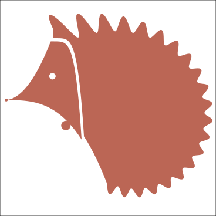

+++
title = "favicon作成"
date = 2021-01-22
[taxonomies]
tags = ["Python", "matplotlib", "その他"]
+++

本ブログ用に favicon を作成しました. 赤いはりねずみです.

* Python (numpy + matplotlib) だけで書かれています. 出力は SVG です.
* 背中の針は Fourier 級数で表現しました.
* 他の部分は二次関数などべき関数の組み合わせです.
* favicon サイズにすると思ったよりディテールが落ちますね...

透過 SVG を出力するときは `plt.savefig` に `transparent=True` というオプションが必要だったんですね.
知りませんでした.

<figure>
    
</figure>
