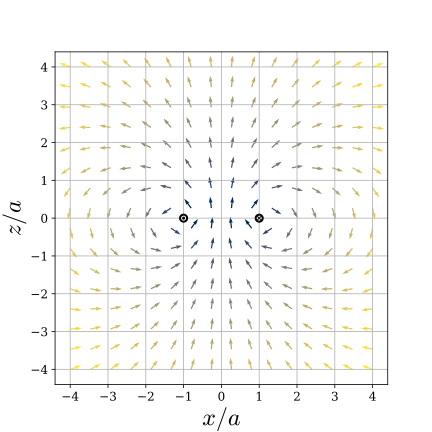

+++
title = "円電流がつくる磁場"
date = 2021-02-20
[extra]
toc = true
[taxonomies]
tags = ["物理学", "電磁気学", "Python", "SymPy"]
+++

半径 $a$ の円状に流れる電流 $I$ がつくる磁場 $\mathbf{B}$ を厳密に求めます.
たいていの教科書には円の中心軸上での表式しか載っていませんが, 任意の点で厳密に求めることができます.

# 準備

円柱座標 $( r, \theta, z )$ の基底を
<math xmlns="http://www.w3.org/1998/Math/MathML" display="inline"><msub><mi mathvariant="bold">e</mi><mi>r</mi></msub></math>, <math xmlns="http://www.w3.org/1998/Math/MathML" display="inline"><msub><mi mathvariant="bold">e</mi><mi>&#x3B8;</mi></msub></math>, <math xmlns="http://www.w3.org/1998/Math/MathML" display="inline"><msub><mi mathvariant="bold">e</mi><mi>z</mi></msub></math> とします.

任意の点 $P ( \mathbf{x} )$ におけるベクトルポテンシャル $\mathbf{A}$ を計算します.
これは, 問題の電流 $C$ に沿う線積分
$$\mathbf{A} \left( \mathbf{x} \right) = \frac{ \mu_0 I }{ 4 \pi } \oint_C \frac{ d\mathbf{x}' }{ | \mathbf{x} - \mathbf{x}' | }$$ 
により与えられます. 回転対称性によりすべての量は角度 $\theta$ に依存しません.
そこで直交座標 $( x, y, z )$ を点 $P$ の $y$ 座標がゼロでありかつ $x > 0$ となるように取ります.
従って点 $P$ の座標は $( r, 0, z )$ で, かつこの点で 
<math xmlns="http://www.w3.org/1998/Math/MathML" display="inline"><msub><mi mathvariant="bold">e</mi><mi>&#x3B8;</mi></msub></math>
は
<math xmlns="http://www.w3.org/1998/Math/MathML" display="inline"><msub><mi mathvariant="bold">e</mi><mi>y</mi></msub></math>
に一致します.


# ベクトルポテンシャルの計算

円電流上の点
$$x = a \cos \theta , \ \ y = a \sin \theta , \ \ z = 0$$
と点 $P$ の距離 $\Delta ( \theta )$ は
$$\Delta^2 ( \theta ) = ( r - a \cos \theta )^2 + a^2 \sin^2 \theta + z^2$$
すなわち
$$\Delta \left( \theta \right) = \sqrt{ a^2 + r^2 + z^2 - 2 a r \cos \theta }$$
により与えられます. 従って
$$\mathbf{A} \left( r, z \right) = \frac{ \mu_0 I }{ 4 \pi } \int_0^{2 \pi} \frac{ a \mathbf{e}_\theta }{ \sqrt{ a^2 + r^2 + z^2 - 2 a r \cos \theta } } d\theta$$
を計算することが目標です.

$e_\theta = - \mathbf{e}_x \sin \theta + \mathbf{e}_y \cos \theta$ であることから明らかに $\mathbf{A}$ の $z$ 成分はゼロです.
さらに, $x$ 成分は, 不定積分
$$\int \frac{ \sin \theta }{ \sqrt{ a^2 + r^2 + z^2 - 2 a r \cos \theta } } d\theta = \frac{ 1 }{ a r } \sqrt{ a^2 + r^2 + z^2 - 2 a r \cos \theta }$$
から容易に計算できてゼロです. という訳で, 非自明なのは $y$ 成分
$$A_y \left( r, z \right) = \frac{ \mu_0 I }{ 4 \pi } \int_0^{2 \pi} \frac{ a \cos \theta }{ \sqrt{ a^2 + r^2 + z^2 - 2 a r \cos \theta } } d\theta$$
だけです. 整理すると
$$A_y \left( r, z \right) = \frac{ \mu_0 I }{ 4 \pi } \sqrt{ \frac{ a }{ 2 r } } \alpha \left( R \right) , \ \ R = \sqrt{ \frac{ a^2 + r^2 + z^2 }{ 2 a r } }$$
$$\alpha \left( R \right) = \int_0^{2 \pi} \frac{ \cos \theta }{ \sqrt{ R^2 - \cos \theta } } d\theta \ \ ( R > 1 )$$
ですから積分 $\alpha ( R )$ を求めればよいです. 


## 楕円積分

まず, 積分区間 $[ 0, \pi ]$ と $[ \pi, 2\pi ]$ は同じ値を与えますから問題の積分を
$$\alpha \left( R \right) = 2 \int_0^\pi \frac{ \cos \theta }{ \sqrt{ R^2 - \cos \theta } } d\theta$$
と書き直すことができます. さらに倍角公式
$$\cos \theta = 1 - 2 \sin^2 \frac{ \theta }{ 2 }$$
を代入し, 変数変換 $\psi = \theta / 2$ を施すと
$$\alpha \left( R \right) = 4 \int_0^\frac{\pi}{2} \frac{ 1 - 2 \sin^2 \psi }{ \sqrt{ R^2 - 1 + 2 \sin^2 \psi } } d\psi .$$
分子分母を $\sqrt{ R^2 - 1 }$ で割ると
$$\alpha \left( R \right) = \frac{ 4 }{ \sqrt{ R^2 - 1 } } \int_0^\frac{\pi}{2} \frac{ 1 - 2 \sin^2 \psi }{ \sqrt{ 1 - m \sin^2 \psi } } d\psi ,$$
$$m = - \frac{ 2 }{ R^2 - 1 } .$$
ここで被積分関数の分子を
$$1 - 2 \sin^2 \psi = R^2 - ( R^2 - 1 ) ( 1 - m \sin^2 )$$
と書き直すと, 問題の積分は
$$\alpha \left( R \right) = \frac{ 4 }{ \sqrt{ R^2 - 1 } } \left[ R^2 \int_0^\frac{\pi}{2} \frac{ d\psi }{ \sqrt{ 1 - m \sin^2 \psi } } - \left( R^2 - 1 \right) \int_0^\frac{\pi}{2} \sqrt{ 1 - m^2 \sin^2 \psi } \, d\psi \right]$$
に帰着されます.

ここで, 第1種および第2種の完全楕円積分 $K ( m )$, $E ( m )$ を
$$K \left( m \right) = \int_0^\frac{\pi}{2} \frac{ d\theta }{ \sqrt{ 1 - m \sin^2 \theta } }$$
$$E \left( m \right) = \int_0^\frac{\pi}{2} \sqrt{ 1 - m \sin^2 \theta } d\theta$$
により定義します. $k = \sqrt{ m }$ を引数とする流儀をよく見ますが, 
ここでは負の $m$ に対する楕円積分が必要なのでこのように定義します.
これを上式と比較すると
$$\int_0^{2 \pi} \frac{ \cos \theta }{ \sqrt{ R^2 - \cos \theta } } d\theta = \frac{ 4 }{ \sqrt{ R^2 - 1 } } \left[ R^2 K \left( - \frac{ 2 }{ R^2 - 1 } \right) - \left( R^2 - 1 \right) E \left( - \frac{ 2 }{ R^2 - 1 } \right) \right]$$
が結論されます.

## 最終結果

これを上の $A_y$ の表式に代入すれば求めるベクトルポテンシャルの表式が得られます.
いま $A_y = A_\theta$ であることから, 円柱座標では
$$A_\theta \left( r, z \right) = \frac{ \mu_0 I }{ \pi } \frac{ a }{ \Delta } \left[ \left( 1 + \frac{ \Delta^2 }{ 2 a r } \right) K \left( - \frac{ 4 a r }{ \Delta^2 } \right) - \frac{ \Delta^2 }{ 2 a r } E \left( - \frac{ 4 a r }{ \Delta^2 } \right) \right]$$
となります. ただし
$$\Delta = \sqrt{ ( r - a )^2 + z^2 }$$
$$m = - \frac{ 4 a r }{ \Delta^2 }$$
とおきました.


# 磁場

ベクトルポテンシャル $\mathbf{A}$ が求まったので, 磁場 $\mathbf{B}$ はその回転
<!-- $$\mathbf{B} = - \frac{ \partial A_\theta }{ \partial z } \mathbf{e}\_r + \frac{ 1 }{ r } \frac{ \partial }{ \partial r } \left( r A_\theta \right) \mathbf{e}_z$$ -->
<math xmlns="http://www.w3.org/1998/Math/MathML" display="block"><mi mathvariant="bold">B</mi><mo>=</mo><mo>-</mo><mfrac><mrow><mo mathvariant="italic">&#x2202;</mo><msub><mi>A</mi><mi>&#x3B8;</mi></msub></mrow><mrow><mo mathvariant="italic">&#x2202;</mo><mi>z</mi></mrow></mfrac><msub><mi mathvariant="bold">e</mi><mi>r</mi></msub><mo>+</mo><mfrac><mn>1</mn><mi>r</mi></mfrac><mfrac><mo mathvariant="italic">&#x2202;</mo><mrow><mo mathvariant="italic">&#x2202;</mo><mi>r</mi></mrow></mfrac><mrow><mo stretchy="true" form="prefix">(</mo><mrow><mi>r</mi><msub><mi>A</mi><mi>&#x3B8;</mi></msub></mrow><mo stretchy="true" form="postfix">)</mo></mrow><msub><mi mathvariant="bold">e</mi><mi>z</mi></msub></math>
として求めることができます. さすがに手計算する気にはならないのですが,
SymPy で数式処理すれば数秒で答えがわかります.
コードはこんな感じでしょうか.

```python
from sympy import symbols, sqrt, simplify, trigsimp, expand, latex
from sympy.functions.special.elliptic_integrals import elliptic_k, elliptic_e

a, r, z = symbols("a, r, z", real=True)

Delta2 = (r - a)**2 + z**2
m = -4*a*r/Delta2

A = a/sqrt(Delta2) * (
    (1 - 2/m) * elliptic_k(m) + 2/m * elliptic_e(m)
)

Br = simplify(- A.diff(z))
Bz = simplify((r * A).diff(r) / r)

Br = simplify(expand(Br))
Bz = simplify(expand(Bz))
print(latex(Br))
print(latex(Bz))
```

ただ `simplify` があまり賢くなかったので, 手で整理した磁場の表式がこちら.

$$B_r \left( r, z \right) = \frac{ \mu_0 I }{ 2 \pi } \frac{
    z \left( (a^2 + r^2 + z^2) E \left( m \right) - ((r + a)^2 + z^2 ) K \left( m \right) \right)
}{
    r \sqrt{(r - a)^2 + z^{2}} \left((r + a)^2 + z^{2}\right)
}$$

$$B_z \left( r, z \right) = \frac{ \mu_0 I }{ 2 \pi } \frac{
    (a^2 - r^2 - z^2) E \left( m \right) + ((r + a)^2 + z^2) K \left( m \right)
}{
    \sqrt{(r - a)^2 + z^{2}} \left((r + a)^2 + z^{2}\right)
}$$

解析的な表式があるので可視化するのも簡単です. 

<figure>
  
  <figcaption>平面 $y = 0$ 上に円電流がつくる磁場. 
  色は磁場の強度 (対数スケール). 黒点は円電流の断面.</figcaption>
</figure>

有名な $z$ 軸上での磁場の表式は $r = 0$ とすることで計算できます.
$E ( 0 ) = K ( 0 ) = \pi / 2$ に注意すると, $B_r = 0$ であり, $B_z$ は 
$$B_z \left( 0, z \right) = \frac{ \mu_0 I a^{2} }{2 \left(a^{2} + z^{2}\right)^{\frac{3}{2}}}$$
という簡単な式になります. 

あるいは $z = 0$ 面内の磁場は, $B_r = 0$ かつ
$$B_z \left( r, 0 \right) = \frac{ \mu_0 I }{ 2 \pi } \frac{
    (a^2 - r^2) E \left( m \right) - (r + a)^2 K \left( m \right)
}{
    |r - a| (r + a)^2
}$$
$$m = - \frac{ 4 a r }{ (r - a)^2 }$$
です.
