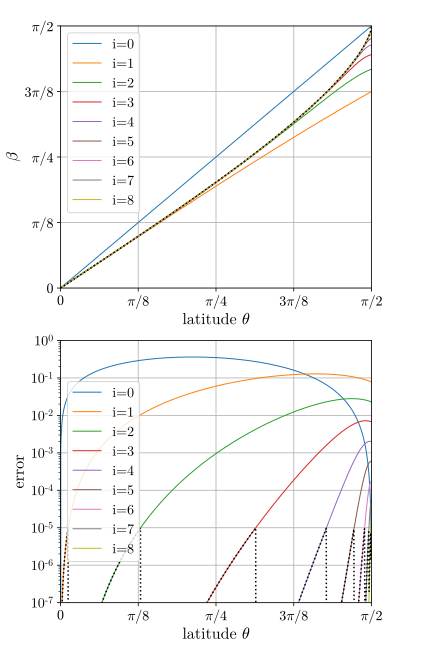

+++
title = "Mollweide図法"
date = 2021-06-05
draft = true
[extra]
toc = true
[taxonomies]
tags = ["数値解析", "数学", ]
+++

本記事では緯度・経度データを可視化するために 
[Mollweide 図法](https://ja.wikipedia.org/wiki/%E3%83%A2%E3%83%AB%E3%83%AF%E3%82%A4%E3%83%87%E5%9B%B3%E6%B3%95)による座標に換算する方法について論じます.


# 緯度と経度

本記事では天文学および地球科学の慣例に従い, 球座標 $( r, \theta, \phi )$ の $\theta$ は赤道面から測った緯度を表すものとします.
数学や物理学では北極から測った $\frac{ \pi }{ 2 } - \theta$ を $\theta$ と書くので注意してください.
$$x = r \cos \theta \cos \phi$$
$$y = r \cos \theta \sin \phi$$
$$z = r \sin \theta$$
また経度 $\phi$ は $( - \pi, \pi ]$ に値を取るものとします (東経・西経と考えればわかりやすいでしょう).
体積要素 $dV$ は
$$dV = r^2 \cos \theta \\, dr \\, d\theta \\, d\phi$$
です.


# Mollweide 図法

緯度と経度の組 $( \theta, \phi )$ を2次元平面の点 $( X, Y )$ への次の写像を Mollweide 図法と呼びます.
$$X = \frac{ \sqrt{ 8 } }{ \pi } \phi \cos \beta$$
$$Y = \sqrt{ 2 } \sin \beta$$
ただし $\beta$ は緯度 $\theta$ の関数で, 次の方程式により陰に定めます.
$$2 \beta + \sin 2 \beta = \pi \sin \theta$$

Mollweide 図法は等積写像です. すなわち, 次式が成立します.
$$\cos \theta \\, d \phi \wedge d \theta = d X \wedge d Y$$
この性質のために, Mollweide 図法は天球面上の星の分布や地表上の温度分布といった分布図に適しています.


# 計算方法

緯度と経度 $( \theta, \phi )$ を Mollweide 図法 $( X, Y )$ に換算するためには上の超越方程式を解く必要があります.
赤道付近 $| \theta | \lesssim \frac{ \pi }{ 8 }$ では
$$\beta \sim \frac{ \pi }{ 4 } \theta$$
と, 極付近 $|\frac{ \pi }{ 2 } - \theta | \lesssim \frac{ \pi }{ 64 }$ では
$$\beta \sim \pm \frac{ \pi }{ 2 } \mp \left[ \frac{ 8 }{ 3 } \left( \frac{ \pi }{ 2 } - \theta \right)^2 \right]^{1/3}$$
(複号は上が北極, 下が南極) と近似解が求まりますが, 一般的には数値的に求める必要があります. 
これは [Newton 法](https://ja.wikipedia.org/wiki/%E3%83%8B%E3%83%A5%E3%83%BC%E3%83%88%E3%83%B3%E6%B3%95)を用いれば簡単です.
つまり, 次の漸化式
$$\beta_0 = \theta$$
$$\beta_{i+1} = \frac{ 2 \beta_i + \sin 2 \beta_i - \pi \sin \theta }{ 2 + 2 \cos 2 \beta_i }$$
を解けば $\beta = \lim_{i \to \infty} \beta_i$ となります. 

ただしもちろん数値的に極限を取ることはできませんから, 漸化式を有限回で打ち切る必要があります.
上記漸化式を第 $i$ 項まで解いたとき, 誤差
$$\left| 2 \beta_i + \sin 2 \beta_i - \pi \sin \theta \right|$$
の大きさをプロットしたものが次の図です.

<figure>
  
  <figcaption>上図: $\theta$ の関数としての $\beta$. 下図: $\beta$ の定義式における誤差.
  色付き実線は Newton 法により求めた結果, 黒の点線は誤差が 10<sup>-5</sup> を超えないように反復回数を調整した場合の結果.</figcaption>
</figure>

ここからわかるように極に近いほど収束が遅いため, 正確な値が必要ならば反復回数を動的に調整するべきです (図中の黒の点線).
しかし, 人が理解しやすいように可視化するという観点からは, 0.1% 程度の誤差は許容範囲でしょうし,
反復回数を8回程度に決め打ちしても実用上十分だと思われます.

もっとも一旦コードをつくってしまえば, あとはそれをコピペするだけです.

# コード

## Python

```python
def mollweide_beta_scalar(lat, err=1e-5):
    if np.abs(2.*lat) == np.pi:
        return lat
    
    beta = lat
    while np.abs( 2.*beta + np.sin(2.*beta) - np.pi*np.sin(lat) ) > err:
        beta -= (2.*beta + np.sin(2.*beta) - np.pi*np.sin(lat))/(2. + 2.*np.cos(2.*beta))
    return beta

mollweide_beta = np.vectorize(mollweide_beta_scalar)

def mollweide(lat, lon):
    beta = mollweide_beta(lat)

    return [
        np.sqrt(8.)/np.pi*lon*np.cos(beta),
        np.sqrt(2.)*np.sin(beta)
    ]
```

## Rust

```rust
pub fn mollweide_beta(lat: f64) -> f64 {
    const ERROR: f64 = 1e-5;
    use std::f64::consts::PI;

    if 2.*lat.abs() == PI { return lat; }

    let mut b = lat;
    while (2.*b + (2.*b).sin() - PI*lat.sin()).abs() > ERROR {
        b -= (2.*b + (2.*b).sin() - PI*lat.sin())/(2. + 2.*(2.*b).cos());
    }

    b
}

pub fn mollweide(lat: f64, lon: f64) -> (f64, f64) {
    use std::f64::consts::{PI, SQRT_2};
    let beta = mollweide_beta(lat);

    ( 2.*SQRT_2/PI*lon*beta.cos(), SQRT_2*beta.sin() )
}
```
