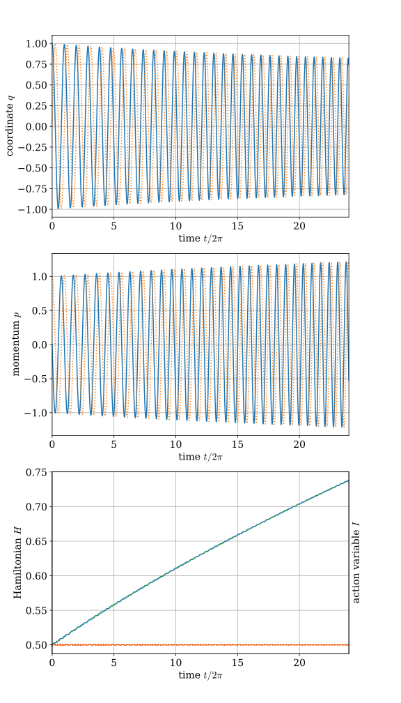

+++
title = "調和振動子における断熱不変量"
date = 2021-06-12
[extra]
toc = true
[taxonomies]
tags = ["物理学", "解析力学", ]
+++

断熱不変量に関する次の論文に調和振動子の振幅 (の二乗) を時刻 $t$ の一次関数的に増大させる場合の厳密解が掲載されていたので,
それをまとめたノートです.

* Wells & Siklos, _The adiabatic invariance of the action variable in classical dynamics_, 
European Journal of Physics, __28__, 1, 105-112 (2007).
arXiv:[physics/0610084](https://arxiv.org/abs/physics/0610084).
doi:[10.1088/0143-0807/28/1/011](https://doi.org/10.1088/0143-0807/28/1/011). 
bibcode:[2007EJPh...28..105W](https://ui.adsabs.harvard.edu/abs/2007EJPh...28..105W/abstract).

# 問題設定

いきなり一般論を扱うのは大変ですから, 具体的に調和振動子について考えます.
Hamiltonian
$$H = \frac{ 1 }{ 2 } p^2 + \frac{ 1 }{ 2 } \omega_0^2 q^2$$
により記述される1次元系は, $\omega_0$ が定数であれば可積分系であり, 容易に求積することができます.
その解は周期運動であり, 周期 $T$ は
$$T = \frac{ 2 \pi }{ \omega_0 }$$
により与えられます. それでは振動数 $\omega_0$ を時間の関数 $\omega^2 ( t )$ に置き換えたとき,
その解はどのようなものでしょうか？ ただし振動数 $\omega$ の時間変化率は運動の周期に比べて十分に遅いものとします.
$$\frac{ 2 \pi }{ \omega } \frac{ 1 }{ \omega } \frac { d \omega }{ d t } \ll 1$$

# 調和振動子の復習

振動数 $\omega_0$ が一定の調和振動子について簡単に復習しておきます.
このとき Hamiltonian $H$ は運動の積分であり, これにより系は可積分となります.
作用-角変数 $( I, \theta )$ は容易に求まり
$$I = \frac{ H }{ \omega_0 } , \ \ \theta = \arcsin \left( \sqrt{ \frac{ \omega_0 }{ 2 I } } q \right)$$
となります. あるいは, 座標 $( q, p )$ および Hamiltonian を作用-角変数で表示すると
$$q = \sqrt{ \frac{ 2 I }{ \omega_0 } } \sin \theta , \ \ p = \sqrt{ 2 \omega_0 I } \cos \theta$$
$$H = I \omega_0$$
です.

## 作用変数の断熱不変性

作用変数 $I$ は断熱不変量です. つまり, パラメータ (いまの場合 $\omega$) のゆっくりとした時間変化に際してその値は近似的に変化しません.
$I = H / \omega$ ですから, $\omega$ をゆっくりと増大させるならば, 系のエネルギーはゆっくりと増大するはずです.
一方, 座標 $q$ の振幅は減少するのに対して, 運動量 $p$ の振幅は増大します.

# 厳密解

振動数 $\omega^2$ が時刻 $t$ の一次関数である場合
$$\omega^2 ( t ) = 1 + \epsilon t$$
には, 振動数が時間変化する調和振動子の厳密解が求められます. 運動方程式
$$\frac{ d^2 q }{ d t^2 } = - ( 1 + \epsilon t ) q$$
において変数変換 $z = - \epsilon^{-\frac{2}{3}} ( 1 + \epsilon t )$ を施すと, 運動方程式は Airy 方程式
$$\frac{ d^2 q }{ d z^2 } - z q = 0$$
に帰着し, それ故にこのふたつの線型独立解は [Airy 関数](https://ja.wikipedia.org/wiki/%E3%82%A8%E3%82%A2%E3%83%AA%E3%83%BC%E9%96%A2%E6%95%B0) 
$\mathrm{Ai}$, $\mathrm{Bi}$ により与えられることになります.
Airy 関数の Wronskian
$$\mathrm{Ai} ( 0 ) \mathrm{Bi}' ( 0 ) - \mathrm{Ai}' ( 0 ) \mathrm{Bi} ( 0 ) = \frac{ 1 }{ \pi }$$
に注意すると[^1], 初期値 $( q_0, p_0 )$ のもとでの解は
$$q ( t ) = a \mathrm{Ai} ( z ) + b \mathrm{Bi} ( z )$$
$$a = \pi \left[ \mathrm{Bi}' ( - \epsilon^{-2/3} ) q_0 + \epsilon^{-1/3} \mathrm{Bi} ( - \epsilon^{-2/3} ) p_0 \right]$$
$$b = - \pi \left[ \mathrm{Ai}' ( - \epsilon^{-2/3} ) q_0 + \epsilon^{-1/3} \mathrm{Ai} ( - \epsilon^{-2/3} ) p_0 \right]$$
と求まります[^2]. この解をプロットしたものが次の図です.

<figure>
  
  <figcaption>
    厳密解のプロット. 実線は初期値 $(q_0, p_0) = (1, 0)$ に, 破線は初期値 $(q_0, p_0) = (0, 1)$ に対応します.
    最下段のプロットにおいて, 青系統の線は Hamiltonian を, 赤系統の線は作用変数を表します.
  </figcaption>
</figure>

断熱不変量の理論の予測通り, 座標 $q$ の振幅は減少する一方, 運動量 $p$ の振幅や Hamiltonian の値は増大しています.
そして作用変数 $I$ の値はほぼ一定です.

## 摂動展開

この厳密解を極限 $\epsilon \to 0$ に関して摂動展開してみます.
いま変数 $z$ は常に負の値ですから, この領域では Airy 関数は次の形に漸近展開されます 
($u_k$ は定数, [1](https://dlmf.nist.gov/9.7#E9), [2](https://dlmf.nist.gov/9.7#E11)). 
$$\mathrm{Ai} ( - z ) \sim \frac{1}{\sqrt{\pi}z^{1/4}}\left(\cos\left(\zeta-\tfrac{1}{4}\pi\right)\sum_{k=0}^{\infty}(-1)^{k}\frac{u_{2k}}{\zeta^{2k}}+\sin\left(\zeta-\tfrac{1}{4}\pi\right)\sum_{k=0}^{\infty}(-1)^{k}\frac{u_{2k+1}}{\zeta^{2k+1}}\right)$$
$$\mathrm{Bi} ( - z ) \displaystyle\sim\frac{1}{\sqrt{\pi}z^{1/4}}\left(-\sin\left(\zeta-\tfrac{1}{4}\pi\right)\sum_{k=0}^{\infty}(-1)^{k}\frac{u_{2k}}{\zeta^{2k}}+\cos\left(\zeta-\tfrac{1}{4}\pi\right)\sum_{k=0}^{\infty}(-1)^{k}\frac{u_{2k+1}}{\zeta^{2k+1}}\right)$$
変数 $\zeta$ は $\zeta = \frac{ 2 }{ 3 } z^\frac{ 3 }{ 2 }$ であり, 今の場合それは
$$\zeta = \frac{ 2 }{ 3 \epsilon } + t + \frac{ 1 }{ 4 } \epsilon t^2 + \cdots$$
と求まります. 初期位相に関する部分は係数 $a$, $b$ の定義に繰り込めるため, $\epsilon \to 0$ で $\cos ( \zeta - \pi / 4 )$ は $\cos t$ に帰着します.
よってこの漸近展開から, 求めた解は $\epsilon \to 0$ で通常の調和振動子の解を再現します.

[^1]: この Wronskian は, Airy 関数の特殊値 ([ref](https://dlmf.nist.gov/9.2#ii))
$$\mathrm{Ai} ( 0 ) = \frac{ 1 }{ 3^{2/3} \Gamma ( 2/3 ) } , \ \ \mathrm{Ai}' ( 0 ) = - \frac{ 1 }{ 3^{1/3} \Gamma ( 1/3 ) }$$
$$\mathrm{Bi} ( 0 ) = \frac{ 1 }{ 3^{1/6} \Gamma ( 2/3 ) } , \ \ \mathrm{Ai}' ( 0 ) = \frac{ 3^{1/6} }{ \Gamma ( 1/3 ) }$$
およびガンマ関数の相反公式
$$\Gamma ( z ) \Gamma ( z ) = \frac{ \pi }{ \sin \pi z }$$
から従います.

[^2]: 原論文は $q = 0$, $\dot{q} = 1$ と書いていますが, $q = 1$, $\dot{q} = 0$ の誤植だと思われます.
